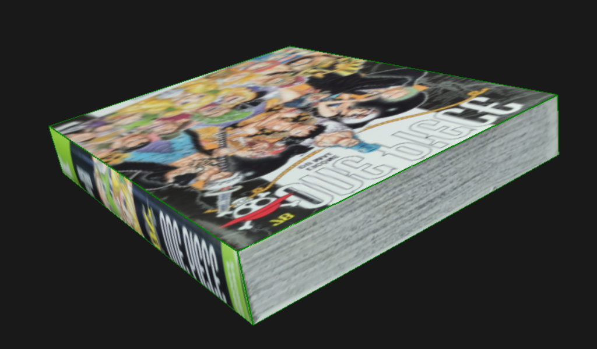

# Single View Metrology
Python implementation of Single View Metrology with a flask web-app where people can import images and test the algorithm. This work was done in the context of a research project as part of the Visual Computing course at CentraleSupélec, 2020-2021.


### Requirements

To install required packages, run the following:
```
python -m pip install -r requirements.txt
```

## Todo
- [x] Single View Metrology Class
- [ ] Texture cropper
- [ ] VRML parser
- [ ] Flask Web-App
